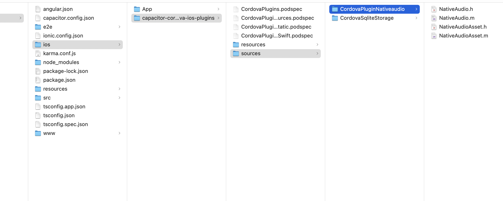

# ionic-playground
Getting Audio to work in ionic 5
1. Install the following plugins
    - npm install cordova-plugin-nativeaudio
    - npm install @ionic-native/native-audio
    - npm install @ionic-native/audio-management

2. Then run npm list to install any missing dependencies manually

3. Run
    - ionic build
    - ionic cap copy
    - ionic cap sync

4. Go to the ios/android folder and edit the NativeAudio files

